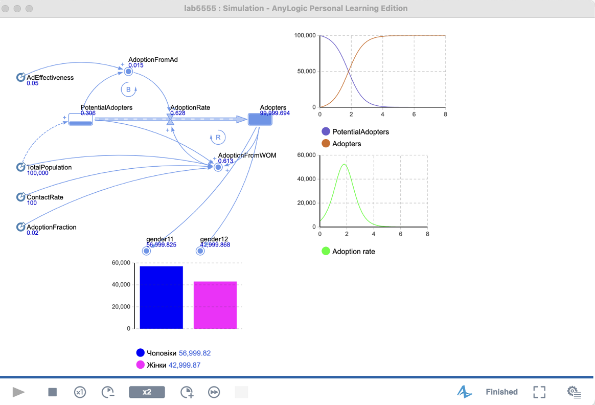

# 🧾 Моделювання систем на AnyLogic

## Основні етапи:

 - побудова структурної схеми моделей;
 - валідація логіки роботи системи;
 - експерименти з різними параметрами;
 - збір статистичних результатів;
 - візуалізація роботи моделі в середовищі AnyLogic.
 - Моделі дозволяють приймати рішення на основі даних симуляції — наприклад, визначати оптимальну кількість ресурсів, оцінювати час обслуговування чи прогнозувати навантаження на систему.

---

## 🖥️ Приклади моделей

